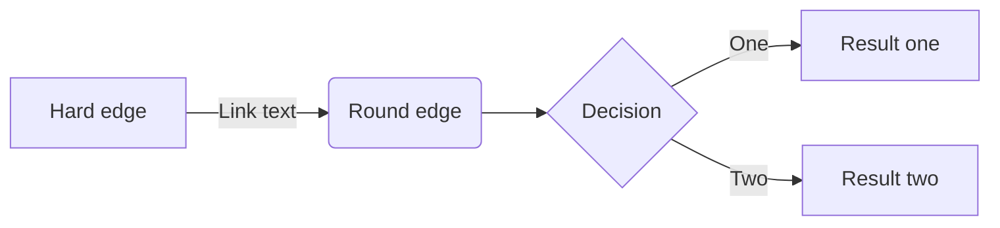
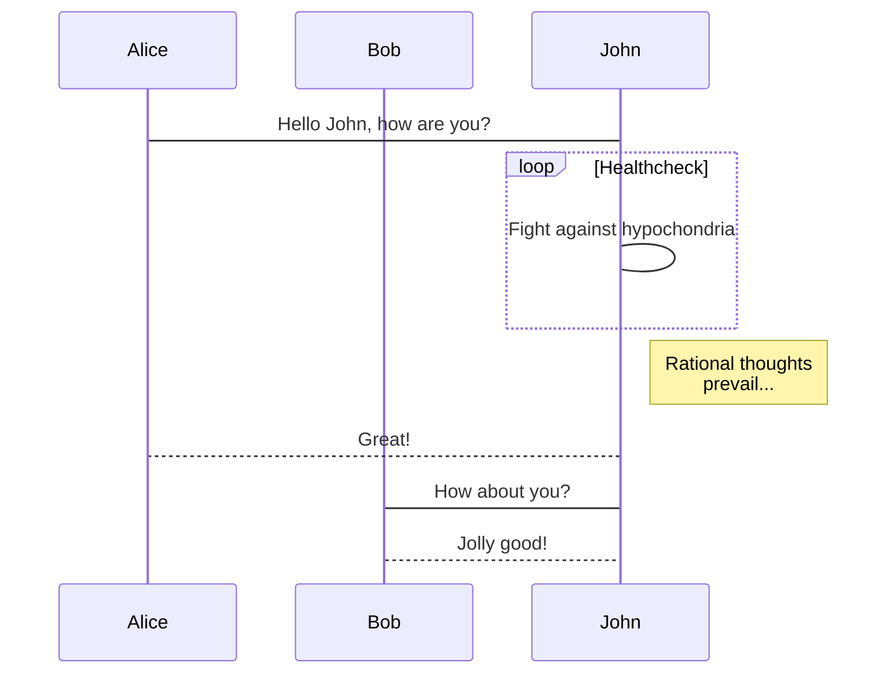

# Nuxt Content Markdown 使用指南

## 一、什么是 Nuxt Content

Nuxt Content 可以使用 `markdown` 来对你的博客进行排版。这是一篇简单的 `markdown` 介绍。与常用的 `markdown` 相似，Nuxt Content 提供了以下能力：

> - 支持 `markdown` 常见的标题、文本、图片、引用等语法
> - 支持常见语言代码块
> - 支持流程图和用例图
> - 支持热更新与在线编辑，但本站浏览模式下关闭了该功能
> - 看需求，以后可能会支持 `LaTeX` 以及更多 `UML` 图

## 二、常见的 markdown 功能

### 1. 支持多级标题

Nuxt Content 支持 h1-h6 标题，这些标题会被自动追加上锚点。其中 h2 和 h3 会被自动整理进左侧的目录栏中。点击标题前的图标或点击目录链接，均可跳转至标题处。

### 2. 丰富的文字排版

除了常见的 **粗体** 和 _斜体_ 之外，Nuxt Content 还支持 `code` 行内代码块。此外 Nuxt Content 支持分割线，图片~~以及删除线~~。emoji 表情也是支持的 :heart:


---

### 3. 引用与跳转

常见的引用与跳转也是支持的，比如[点击这里](https://content.nuxtjs.org/)将会跳转去 `nuxt/content` 官网。

> 当然像这样的文字引用框也是支持的。

### 4. 列表

支持有序列表与无序列表

1. 有序列表第一项
2. 有序列表第二项
3. 有序列表第三项

- 无序列表第一项
- 无序列表第二项
- 无序列表第三项

## 三、高级功能

### 1. 表格

| 人名左对齐 | 性别右对齐 | 职业居中对齐 |
| :--------- | ---------: | :----------: |
| Evan       |         男 |    程序员    |
| Fiona      |         女 |    设计师    |

### 2. todo 列表

1. [x] 初始化 Nuxt
2. [x] 完善布局、中间件、404 路由
3. [ ] 完成 Nuxt Content

### 3. 高亮一段代码

```js
const log = () => {
  console.log('Hi Evan')
}
```

### 4. 绘制流程图



### 5. 绘制时序图


